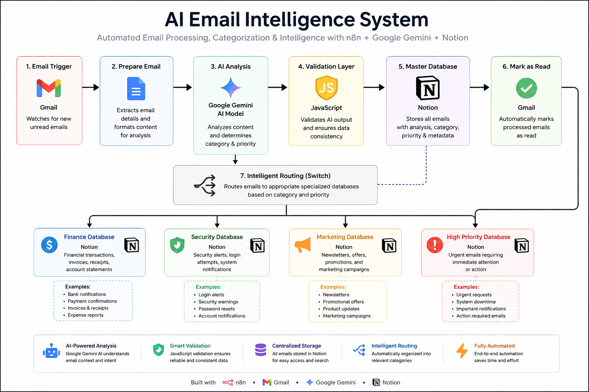

# AI Email Intelligence System

An AI-powered email automation system that analyzes Gmail messages with Google Gemini, validates AI output, stores every email in a master database, and intelligently routes emails into specialized business workflows.



## Overview

The AI Email Intelligence System is a production-style workflow built with **n8n**, **Google Gemini**, **Gmail**, **JavaScript**, and **Notion**.

It automatically monitors incoming Gmail messages, uses AI to analyze and classify each email, validates the AI output before any business action is taken, stores every processed email in a centralized database, and intelligently routes emails into specialized workflows such as Finance, Security, Marketing, and High-Priority alerts.

The workflow was designed with reliability, modularity, and maintainability in mind, ensuring that every email is processed consistently while keeping the architecture easy to extend with additional business workflows.

## Key Features

- 🤖 AI-powered email analysis using Google Gemini
- 📧 Automatic Gmail email processing
- ✅ JavaScript validation layer to verify AI output
- 🗂️ Centralized Master Notion Database for every processed email
- 🔀 Intelligent email routing using Switch nodes
- 💰 Dedicated Finance email database
- 🚨 High-priority email detection
- 📝 Workflow logging for validation failures
- 🔄 Retry logic for improved reliability
- 🧩 Modular architecture for future expansion

## Technology Stack

| Category | Technology |
|----------|------------|
| Workflow Automation | n8n |
| Artificial Intelligence | Google Gemini |
| Email Service | Gmail |
| Database | Notion |
| Programming Language | JavaScript |
| Version Control | Git & GitHub |

## Workflow Overview

1. A new email arrives in Gmail.
2. The email is prepared and sent to Google Gemini for analysis.
3. Gemini returns structured information such as category, priority, summary, and action items.
4. A JavaScript validation layer verifies and normalizes the AI output.
5. Every processed email is stored in the Master Notion Database.
6. The email is marked as read in Gmail.
7. A Switch node routes the email based on its category.
8. Specialized workflows process Finance, Security, Marketing, and High-Priority emails.
9. Failed validations are logged for review and troubleshooting.

## Engineering Decisions

Several design decisions were made to improve the reliability and maintainability of the system:

- **Validation before execution** – AI-generated output is validated before any database updates or business actions are performed.
- **Centralized storage** – Every processed email is stored in a Master Notion Database to provide a complete audit trail.
- **Separation of responsibilities** – AI analysis, validation, storage, and routing are handled in separate stages, making the workflow easier to maintain and extend.
- **Modular routing** – A Switch node routes emails into specialized workflows, allowing new business categories to be added with minimal changes.
- **Fault tolerance** – Retry logic and validation failure logging improve resilience against temporary API failures and malformed AI responses.

## Project Structure

```
AI-Email-Intelligence-System/
│
├── workflow.json                 # Main n8n workflow
├── README.md                     # Project documentation
├── LICENSE
├── .gitignore
├── docs/
│   └── system-architecture.png   # Architecture diagram
└── images/
    ├── workflow-overview.png
    ├── master-database.png
    ├── finance-database.png
    ├── workflow-log.png
    └── successful-execution.png
```